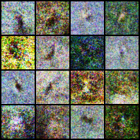

# 机器学习导引结课论文
机器学习导引结课论文的项目。

## 项目介绍
学习GAN，将GAN应用于mnist和cub数据集，生成新的图片，用来进行数据增强。

## 运行
数据集放在根目录的data文件夹下
### 目录结构
```
|-- data
    |-- mnist
    |-- CUB_200_2011
        |-- train
|-- data_utils.py
|-- gan.py
|-- my_dataset.py

```
### 运行指令
`python gan.py`

## 结果截图
gan 用在cub的生成图片 



gan 用在mnist的生成图片


## 参考链接

核心代码gan.py参考自https://github.com/eriklindernoren/PyTorch-GAN